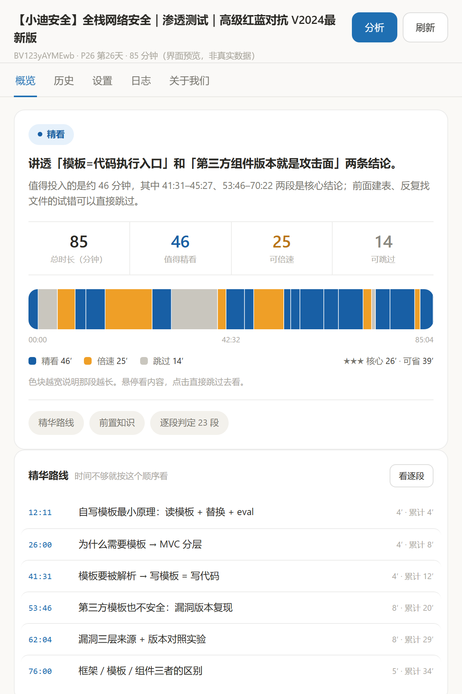
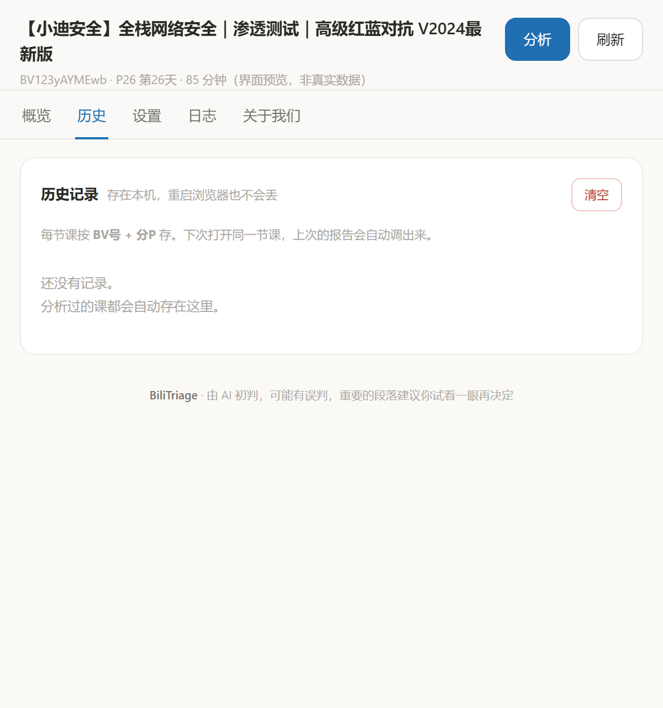

# BiliTriage · 这节课值不值得认真看

在 B 站视频页点一下，得到一份**观看向导**：哪段必须精看、哪段倍速就行、哪段可以直接跳过，
以及这门课你到底需要投入多少分钟。

**它不是笔记工具。** 笔记工具的目标是「完整、不遗漏」；这个工具的目标是**帮你少看**。



---

## 为什么做这个

网课最容易浪费时间的不是听不懂，是**你根本不知道这 85 分钟里有多少是废话**。

我拿一节 85 分钟的渗透测试课实测：真正值得完整投入的是 46 分钟，其中不可跳过的核心只有 26 分钟，
另外 12 分钟是纯鼠标操作和找错文件。中间那段「改了模板目录 → 重启 → 还是没反应 → 全局搜索」足足 6 分半，
老师自己都说「这不叫翻车，只是信息没整理好」。

现有工具（BiliNote 等）做的是**看完之后留下什么**：结构化笔记、自动截图、原片跳转。
它们的目标是"内容全面"，所以你不可能从里面读到"这段别看"。

这个扩展做的是**看之前决定怎么看**。两者的价值函数是相反的。

---

## 安装（30 秒）

**方式一：下载 zip（推荐给不想折腾的人）**

去 [**Releases**](https://github.com/viphzz/BiliTriage/releases) 下载最新版 `BiliTriage-v*.zip`，
解压到一个**路径不含中文**的目录，然后按下面的方式二加载。

**方式二：从源码加载**

1. 打开 `chrome://extensions/`（Edge 是 `edge://extensions/`）
2. 右上角打开 **开发者模式**
3. 点 **加载已解压的扩展程序**，选择本仓库目录
4. **打开任意 B 站视频页并刷新一次**（刚装完必须刷新，页面脚本才会注入）

不需要 npm、不需要构建、没有任何后端。

## 使用

1. 打开一节网课 → 页面右下角出现 **「判断这节课」** → 点击（或直接点工具栏的扩展图标）
2. 弹窗自动识别当前 BV 号和分 P 号 → 点 **「分析」**
3. 首次需要配置一个大模型（见下），之后一键出结果

报告里**时间轴的每一段、逐段列表的任意一行、精华路线的任意一行都可以点**，
点了播放器直接跳到那一秒；如果那条记录不是当前这节，会先帮你切过去再跳。

时间轴色块**按真实时长分配宽度** —— 越宽就是那段越长，一眼就能看出哪一段最耗时间。
悬停会高亮当前段并显示「起止时间 + 主题 + 判定 + 时长」。

| 历史记录 | 逐段判定 |
|---|---|
|  | 滑到概览下方即可看到 |

## 报告里有什么

| 字段 | 含义 |
|---|---|
| **结论** | 一句话说清这节讲什么、值不值得学，并引用具体时间点作为证据 |
| **时长账本** | 总时长 / 值得精看 / 可倍速 / 可跳过，四个数字一眼看清 |
| **时间轴** | 分段色块，可点击跳转，悬停看详情 |
| **逐段判定** | 每段给「精看 / 倍速 / 跳过」+ 信息密度 + 类型 + 一句话说明，可筛选 |
| **精华路线** | 时间不够时的最小观看序列，带累计分钟数 |
| **前置知识** | 缺了哪些前置内容会导致某些精看段接不上（会映射到合集里具体第几讲） |

## 配置大模型（二选一）

**A. 自动模式**：设置页填 Base URL / 模型名 / API Key，保存即可全自动跑完。
预设已覆盖 DeepSeek、OpenAI、Moonshot、通义、硅基流动、智谱、火山、OpenRouter；
用其他服务商时保存会弹一次授权。

**B. 手动模式**：不填 Key。点分析后会给出提示词，复制 → 交给任意 AI（ChatGPT / Kimi / Claude 都行）→
把返回的 JSON 粘回来 → 生成报告。两条路出口是同一份报告。

> Key 只存在你自己的浏览器里（`chrome.storage.local`），扩展不采集、不上传任何数据。

---

## 实现要点

### 怎么拿到字幕（同时也是最省事的登录态方案）

B 站的播放器接口 `x/player/wbi/v2` 只在**带登录 Cookie** 时才返回字幕轨，否则 `subtitles` 是空数组。

常规做法是用 `chrome.cookies` 读出 `SESSDATA`，再拼进请求头 —— **这条路走不通**：
`Cookie` 是 forbidden header，`fetch` 里设置会被浏览器静默忽略。

所以这里改成**在 B 站页面的主世界代发请求**：

```js
chrome.scripting.executeScript({
  target: { tabId },
  world: "MAIN",
  func: async (urls) => { /* fetch(url, { credentials: "include" }) */ },
  args: [urls],
});
```

请求由页面自己发出，登录态自动带上 —— 结果是**用户不需要填任何凭据**。

### 判定提示词（和笔记工具的关键差别）

要求模型输出固定 schema 的 JSON，每条必须是「起止时间 + 主题 + 类型 + 建议动作」，
并且显式给出这类指令：

- 精看：讲原理、讲结论、复现过程、方法论、思路转折、易错点
- 倍速：必要的操作过程，看懂"在做什么"就够
- 跳过：重复前面讲过的、纯鼠标操作、报错排查、找错文件、闲聊吐槽、无信息量过渡
- **必须警惕"藏在答疑/闲聊里的高价值段"** —— 这类段落最容易漏判为跳过
- `net_value_min` 必须等于所有精看段时长之和（强制核账，不允许模型瞎估）

`temperature` 压到 0.2：下「这段是废话」的判断需要稳定，而不是文风流畅。

---

## 已知限制

- **只依赖 B 站官方 AI 字幕**（浏览器里跑不了本地语音识别）。没有字幕的视频会提示改用桌面版。
- 官方字幕**也是机器生成的**，有错别字。实证：`phpinfo` 会被写成 "PPNFO"、`Smarty` 写成 "smart"。
  判定结论可靠，**但抄代码必须看画面**。
- 没做关键帧 OCR，所以"这段在敲什么"是从讲解**推断**出来的，不是画面直读。
- 判定是模型初筛，**会误判**，尤其是藏在答疑里的高价值段。请以自己试看为准。

## 权限说明

| 权限 | 用途 |
|---|---|
| `scripting` | 在 B 站页面主世界代发 API 请求，借用页面登录态 |
| `storage` | 存你的 API Key、分析记录与运行日志（仅本机浏览器） |
| `tabs` / `activeTab` | 读取当前标签页 URL 以解析 BV 号和分 P |
| `host_permissions` | 13 个预设域名：B 站、字幕 CDN、各主流大模型 API |
| `optional_host_permissions` | 你填了其他服务商时才会申请，不会预先索取 |

## 文件

```
manifest.json    MV3 清单
background.js    service worker：页面主世界代发请求 + 跑大模型长任务
content.js       页面内入口按钮 + 播放器跳转
content.css      入口按钮 / 提示条样式
popup.html       弹窗 UI（概览 / 历史 / 设置 / 日志 / 关于我们）
popup.js         全部逻辑：取字幕 → 切片 → 提示词 → 提交后台 → 渲染
docs/            界面截图 + 联系方式二维码
```

## 联系

这个扩展是我自己上网课时做的工具，判断逻辑一直在调。如果你发现有什么问题、哪些部分需要优化，随时欢迎联系我。

<p align="center">
  
</p>

也可以在 [GitHub Issues](https://github.com/viphzz/BiliTriage/issues) 提，我会看。
扩展里的「**关于我们**」标签页也有这个码，不用回这里找。

## 更新日志

**v0.6.0** 新增「关于我们」标签页（联系方式、赞赏码、项目链接，以及一段关于误判的说明）；
README 补充下载方式与联系方式二维码。

**v0.5.1** 界面去 AI 味 + 文案人性化：标签栏改为下划线式、卡片弱化边框、数字改分隔线排、
时间轴悬停高亮当前段；进度与结果文案从机器腔改为自然语句。

**v0.5.0** 移除「自动跟播」功能，扩展回到**纯分析 + 页内跳转**的定位。
（该功能曾在 v0.3–v0.4 提供自动倍速与跳过，相关设计与代码已归档，不在本仓库内。）

**v0.4.1** 修复「刷新后页面脚本未响应」：`chrome.tabs.reload()` 后标签页状态会短暂停留在旧的
`complete`，轮询会撞上"假完成"然后向正在卸载的页面发消息。改为主监听 `loading → complete`
的完整过程，并用主动 ping + 重试确认内容脚本真的活着。

**v0.4.0** 新增匹配码自动调取（BV号 + 分P）、历史记录可就地查看、独立日志系统。

**v0.3.x** 弹窗化（含把大模型调用搬进 service worker，避免弹窗关闭中断任务）、时间轴按真实时长分配宽度。

**v0.1.1** 修复点击时间轴不跳转：MV3 扩展页 CSP 为 `script-src 'self'`，**内联 `onclick` 会被拒绝执行**，
动态 HTML 里的内联事件全部失效。改为 `data-*` 标记 + 事件委托。

**v0.1.0** 首个版本。

## License

[MIT](LICENSE)
